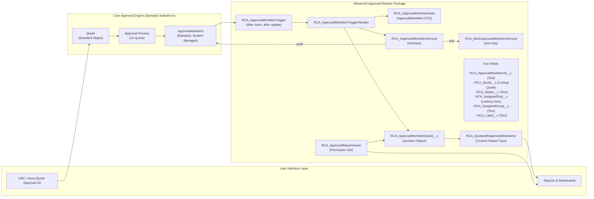

## Advanced Approval Reports – Architecture

This document describes the architecture and end‑to‑end technical flow for the **Advanced Approval Reports** package, which enables reporting on Quote approval work items.

---

## Logical Architecture

---

## End‑to‑End Technical Flow

### 1. Quote Submission for Approval

- **User submits a Quote for approval** via:
  - LWC / Aura component (e.g., `RCA_QuoteApprovalLWCController`) or
  - Standard “Submit for Approval” on `Quote`.
- The **Quote Approval Process** (standard Salesforce) is invoked.

### 2. Standard Approval Engine – Work Item Creation

- The **Approval Process** evaluates criteria and steps.
- Salesforce creates one or more **`ApprovalWorkItem`** records:
  - `RelatedRecordId` → `Quote.Id`
  - `RelatedRecordObjectName` → `'Quote'`
  - `Status`, `AssignedToId`, `ApprovalChainName`, etc. are set by the platform.

### 3. Trigger Execution on `ApprovalWorkItem`

- The custom **trigger** `RCA_ApprovalWorkItemTrigger` is registered on `ApprovalWorkItem`:
  - Events: `after insert`, `after update`.
- On execution, the trigger delegates to the handler:
  - `RCA_ApprovalWorkItemTriggerHandler.handleAfterInsert(List<ApprovalWorkItem>)`
  - `RCA_ApprovalWorkItemTriggerHandler.handleAfterUpdate(List<ApprovalWorkItem>, Map<Id, ApprovalWorkItem>)`

### 4. Filtering and DTO Conversion

- The handler:
  - **Filters** records to those where:
    - `RelatedRecordObjectName == 'Quote'`
    - `RelatedRecordId != null`
  - **Converts** each work item into a `RCA_ApprovalWorkItemData` DTO:
    - `workItemId`
    - `relatedRecordId`
    - `relatedRecordObjectName`
    - `status`
    - `assignedToId`
    - `approvalChainName`
- DTOs encapsulate all logic away from direct `ApprovalWorkItem` DML, making the code testable and resilient to platform restrictions.

### 5. Assignee Resolution (User vs Queue/Group)

- `ApprovalWorkItem.AssignedToId` is **polymorphic** (User, Queue, Group).
- The handler uses helper methods:
  - **`getUserAssigneeId(String assignedToId)`**
    - Attempts to cast the Id to a `User` Id.
    - Returns a valid `User` Id or `null` if the Id is for a Queue/Group.
  - **`resolveAssigneeNames(List<RCA_ApprovalWorkItemData>)`**
    - Gathers all distinct assignee Ids from DTOs.
    - Queries `User` and `Group`:
      - For `User` → map `Id` → `User.Name`.
      - For `Group`/Queue → map `Id` → `Group.Name`.
    - Returns a `Map<String, String>`: `assigneeId → assigneeName`.

This map is later used to populate:

- **`RCA_AssignedToId__c`** – when the assignee is a **User**.
- **`RCA_AssignedGroup__c`** – when the assignee is a **Queue/Group** (stores the name).

### 6. Junction Record Creation and Update

- The handler ensures a **1:1 mapping** between `ApprovalWorkItem` and `RCA_ApprovalWorkItemQuote__c`:
  - Queries existing junctions by `RCA_ApprovalWorkItemId__c` (Text representation of `ApprovalWorkItem.Id`).
  - For each DTO:
    - If a junction exists:
      - `updateJunctionFields(...)` updates:
        - `RCA_Status__c`
        - `RCA_AssignedToId__c`
        - `RCA_AssignedGroup__c`
        - `RCA_Label__c`
    - If not:
      - `createJunctionRecord(...)` creates a new `RCA_ApprovalWorkItemQuote__c` with:
        - `RCA_ApprovalWorkItemId__c` = stringified `workItemId`
        - `RCA_Quote__c` = `relatedRecordId` (Quote lookup)
        - `RCA_Status__c` = `status`
        - `RCA_AssignedToId__c` = resolved User Id (if applicable)
        - `RCA_AssignedGroup__c` = resolved Queue/Group name (if applicable)
        - `RCA_Label__c` = `approvalChainName`
- All inserts and updates are performed in **bulk** via `performDML(...)` to maintain governor‑limit safety.

### 7. Reporting and Analytics Layer

- **Object**: `RCA_ApprovalWorkItemQuote__c`
  - Acts as a junction between `ApprovalWorkItem` and `Quote`.
  - Stores the approval status and assignee context in a **report‑friendly** form.
- **Custom Report Type**: `RCA_QuotewithApprovalWorkItems`
  - Primary object: `Quote`.
  - Child object: `RCA_ApprovalWorkItemQuote__c`.
  - Exposes:
    - Quote fields (via `RCA_Quote__c`).
    - Junction fields (status, assigned user, assigned group, label, etc.).
- **Reports & Dashboards**:
  - Users can build:
    - Pending approvals for Quotes.
    - Approval history with Quote, Account, Opportunity context.
    - Worklist views for approvers using `Assigned User` / `Assigned Group`.

### 8. Security and Access Control

- **Permission Set**: `RCA_ApprovalReportViewer`
  - **Object and Field Access**:
    - Read access to `RCA_ApprovalWorkItemQuote__c`.
    - Field‑level security for:
      - `RCA_ApprovalWorkItemId__c`
      - `RCA_Quote__c`
      - `RCA_Status__c`
      - `RCA_AssignedToId__c` (Assigned User)
      - `RCA_AssignedGroup__c` (Assigned Group)
      - `RCA_Label__c`
  - **Apex Class Access**:
    - `RCA_ApprovalWorkItemTriggerHandler`
    - `RCA_ApprovalWorkItemData`
    - Other supporting classes in the package as needed.
- Assigning this permission set to users ensures:
  - They can see the junction records and fields in reports.
  - They can use the custom report type and related dashboards.

---

## Summary

- **Core idea**: Mirror key `ApprovalWorkItem` data into a first‑class, reportable junction object `RCA_ApprovalWorkItemQuote__c` linked to `Quote`.
- **Key benefits**:
  - Rich reporting on Quote approvals (status, assignee, chain label).
  - Proper handling of polymorphic assignees (User vs Queue/Group).
  - Testable, modular Apex using DTOs and interfaces.

